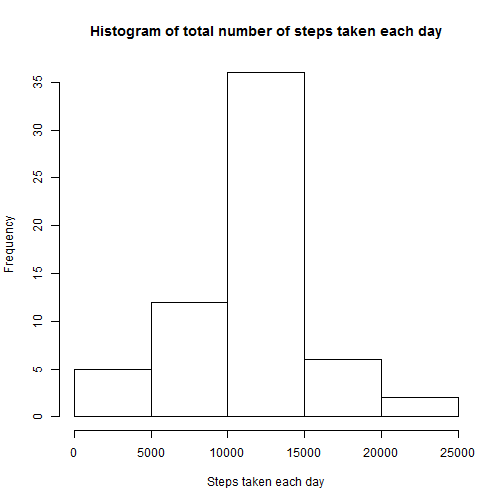
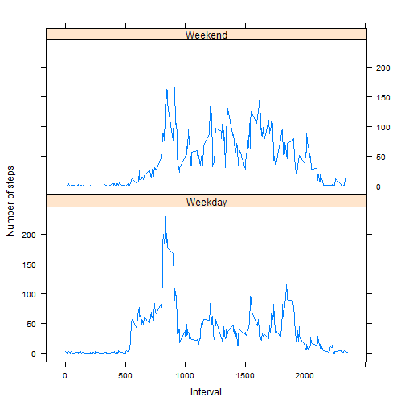

# Reproducible Research: Peer Assessment 1
Wearable technology is gaining major ground in the technological world with a huge variety of devices being introduced into the market. These devices generally measure the environment of the human user using a variety of sensors. The data collected from such sensors are often under utilized due to its huge volume and lack of statistical techniques to process and interpret the data in useful ways.

This report presents a preliminary analysis on the number of steps taken by an annoymous individual during the months of October and November, 2012 and includes the number of steps taken by the individual in 5 minute interval.

## Loading and preprocessing the data
This section loads the data and converts the date column into a standard POSIX format for easier handling later on.

```r
unzip("activity.zip")
activityData <- read.csv("activity.csv")
activityData$date <- as.Date(activityData$date, format = "%Y-%m-%d")
```


## What is mean total number of steps taken per day?
This section finds the distribution of the number of steps taken each day that the individual was observed. The distribution is shown as a histogram. Any missing value in the data set is ignored.

```r
totalStepDay <- sapply(split(activityData, activityData$date), function(x) sum(x$steps, 
    na.rm = TRUE))
hist(totalStepDay, main = "Histogram of total number of steps taken each day", 
    xlab = "Steps taken each day")
```

 

```r
meanStepDay <- mean(totalStepDay, na.rm = T)
medianStepDay <- median(totalStepDay, na.rm = T)
```

The mean number of steps taken each day is 9354.2295 while the median is 10395.

## What is the average daily activity pattern?
This section shows the average number of steps taken for each interval for all the days in the data set as a line plot.

```r
meanStepInterval <- sapply(split(activityData, activityData$interval), function(x) mean(x$steps, 
    na.rm = T))
maxMeanStep <- max(meanStepInterval)
maxInterval <- names(meanStepInterval)[which(meanStepInterval == maxMeanStep)]
plot(names(meanStepInterval), meanStepInterval, type = "l", main = "Average number of steps taken each interval", 
    xlab = "Interval", ylab = "Steps")
```

 

The maximum mean step of 206.1698 was observed in interval 835.


## Imputing missing values
A total of 2304 out of 17568 rows in the original data set is incomplete. Hence to account for any bias introduced a data imputing algorithm is proposed that replaces all missing values by the average number of steps taken during that interval over all days.

```r
activityImputData <- activityData  #The imputed data is stored in new data frame
# The mean number of steps taken over each interval is repeated to equal the
# number of days
repMeanStep <- rep(meanStepInterval, length(unique(activityData$date)))
# Missing steps are replaced by mean value of steps for that particular
# interval
activityImputData$steps[is.na(activityImputData$steps)] <- as.integer(repMeanStep[is.na(activityImputData$steps)])
```

The histogram and per day mean and median number of steps are calculated as before for the imputed data.

```r
totalStepDay <- sapply(split(activityImputData, activityImputData$date), function(x) sum(x$steps, 
    na.rm = TRUE))
hist(totalStepDay, main = "Histogram of total number of steps taken each day", 
    xlab = "Steps taken each day")
```

 

```r
meanStepDay <- mean(totalStepDay, na.rm = T)
medianStepDay <- median(totalStepDay, na.rm = T)
```

The mean number of steps taken each day for the imputed data set is 10749.77 while the median is 10641.
It can be observed that imputing the data set has transformed the histogram to a more normal format as expected since the missing values were replaced by the mean value.


## Are there differences in activity patterns between weekdays and weekends?
Finally a line plot showcasing the difference of average activity level during the weekdays and weekends is shown below for comparison.

```r
#Identify the weedays & weekends
activityImputData$day <- weekdays(activityImputData$date)
activityImputData$day[activityImputData$day %in% c("Saturday", "Sunday")] <- "Weekend"
activityImputData$day[!(activityImputData$day %in% c("Weekend"))] <- "Weekday"

#Split data by the type of day and find the mean number of steps for both the categories
require(reshape2)
```

```
## Loading required package: reshape2
```

```r
stepByDay <- split(activityImputData, activityImputData$day)
meanStepByDay <- sapply(stepByDay, #Apply on each type of day
                        function(x) sapply(split(x, x$interval), #Split into intervals for each day
                                           function(y) 
                                             mean(y$steps) #Calculate the mean for each interval
                                           )
                        )
meanStepByDay <- melt(meanStepByDay, 
                      varnames=c("Interval", "day"), 
                      value.name="steps")
require(lattice)
```

```
## Loading required package: lattice
```

```r
xyplot(steps~Interval|day, 
       meanStepByDay,
       type="l",
       ylab="Number of steps",
       layout=c(1,2))
```

 

