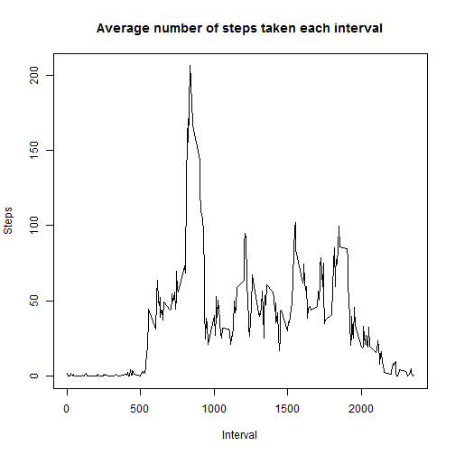

# Reproducible Research: Peer Assessment 1


## Loading and preprocessing the data

```r
unzip("activity.zip")
activityData <- read.csv("activity.csv")
activityData$date <- as.Date(activityData$date, format = "%Y-%m-%d")
```


## What is mean total number of steps taken per day?

```r
totalStepDay <- sapply(split(activityData, activityData$date), function(x) sum(x$steps, 
    na.rm = TRUE))
hist(totalStepDay)
```

 

```r
meanStepDay <- sapply(split(activityData, activityData$date), function(x) mean(x$steps, 
    na.rm = TRUE))
medianStepDay <- sapply(split(activityData, activityData$date), function(x) median(x$steps, 
    na.rm = TRUE))
data.frame(meanSteps = meanStepDay, medianSteps = medianStepDay)
```

```
##            meanSteps medianSteps
## 2012-10-01       NaN          NA
## 2012-10-02    0.4375           0
## 2012-10-03   39.4167           0
## 2012-10-04   42.0694           0
## 2012-10-05   46.1597           0
## 2012-10-06   53.5417           0
## 2012-10-07   38.2465           0
## 2012-10-08       NaN          NA
## 2012-10-09   44.4826           0
## 2012-10-10   34.3750           0
## 2012-10-11   35.7778           0
## 2012-10-12   60.3542           0
## 2012-10-13   43.1458           0
## 2012-10-14   52.4236           0
## 2012-10-15   35.2049           0
## 2012-10-16   52.3750           0
## 2012-10-17   46.7083           0
## 2012-10-18   34.9167           0
## 2012-10-19   41.0729           0
## 2012-10-20   36.0938           0
## 2012-10-21   30.6285           0
## 2012-10-22   46.7361           0
## 2012-10-23   30.9653           0
## 2012-10-24   29.0104           0
## 2012-10-25    8.6528           0
## 2012-10-26   23.5347           0
## 2012-10-27   35.1354           0
## 2012-10-28   39.7847           0
## 2012-10-29   17.4236           0
## 2012-10-30   34.0938           0
## 2012-10-31   53.5208           0
## 2012-11-01       NaN          NA
## 2012-11-02   36.8056           0
## 2012-11-03   36.7049           0
## 2012-11-04       NaN          NA
## 2012-11-05   36.2465           0
## 2012-11-06   28.9375           0
## 2012-11-07   44.7326           0
## 2012-11-08   11.1771           0
## 2012-11-09       NaN          NA
## 2012-11-10       NaN          NA
## 2012-11-11   43.7778           0
## 2012-11-12   37.3785           0
## 2012-11-13   25.4722           0
## 2012-11-14       NaN          NA
## 2012-11-15    0.1424           0
## 2012-11-16   18.8924           0
## 2012-11-17   49.7882           0
## 2012-11-18   52.4653           0
## 2012-11-19   30.6979           0
## 2012-11-20   15.5278           0
## 2012-11-21   44.3993           0
## 2012-11-22   70.9271           0
## 2012-11-23   73.5903           0
## 2012-11-24   50.2708           0
## 2012-11-25   41.0903           0
## 2012-11-26   38.7569           0
## 2012-11-27   47.3819           0
## 2012-11-28   35.3576           0
## 2012-11-29   24.4688           0
## 2012-11-30       NaN          NA
```


## What is the average daily activity pattern?

```r
meanStepInterval <- sapply(split(activityData, activityData$interval), function(x) mean(x$steps, 
    na.rm = T))
maxMeanStep <- max(meanStepInterval)
maxInterval <- names(meanStepInterval)[which(meanStepInterval == maxMeanStep)]
plot(meanStepInterval, type = "l")
```

 

The maximum mean step of 206.1698 was observed in interval 835.


## Imputing missing values
A total of 2304 out of 17568 rows are incomplete.

```r
activityImputData <- activityData
repMeanStep <- rep(meanStepInterval, length(unique(activityData$date)))
activityImputData$steps[is.na(activityImputData$steps)] <- as.integer(repMeanStep[is.na(activityImputData$steps)])
```


```r
totalStepDay <- sapply(split(activityImputData, activityImputData$date), function(x) sum(x$steps, 
    na.rm = TRUE))
hist(totalStepDay)
```

 

```r
meanStepDay <- sapply(split(activityImputData, activityImputData$date), function(x) mean(x$steps, 
    na.rm = TRUE))
medianStepDay <- sapply(split(activityImputData, activityImputData$date), function(x) median(x$steps, 
    na.rm = TRUE))
data.frame(meanSteps = meanStepDay, medianSteps = medianStepDay)
```

```
##            meanSteps medianSteps
## 2012-10-01   36.9479        33.5
## 2012-10-02    0.4375         0.0
## 2012-10-03   39.4167         0.0
## 2012-10-04   42.0694         0.0
## 2012-10-05   46.1597         0.0
## 2012-10-06   53.5417         0.0
## 2012-10-07   38.2465         0.0
## 2012-10-08   36.9479        33.5
## 2012-10-09   44.4826         0.0
## 2012-10-10   34.3750         0.0
## 2012-10-11   35.7778         0.0
## 2012-10-12   60.3542         0.0
## 2012-10-13   43.1458         0.0
## 2012-10-14   52.4236         0.0
## 2012-10-15   35.2049         0.0
## 2012-10-16   52.3750         0.0
## 2012-10-17   46.7083         0.0
## 2012-10-18   34.9167         0.0
## 2012-10-19   41.0729         0.0
## 2012-10-20   36.0938         0.0
## 2012-10-21   30.6285         0.0
## 2012-10-22   46.7361         0.0
## 2012-10-23   30.9653         0.0
## 2012-10-24   29.0104         0.0
## 2012-10-25    8.6528         0.0
## 2012-10-26   23.5347         0.0
## 2012-10-27   35.1354         0.0
## 2012-10-28   39.7847         0.0
## 2012-10-29   17.4236         0.0
## 2012-10-30   34.0938         0.0
## 2012-10-31   53.5208         0.0
## 2012-11-01   36.9479        33.5
## 2012-11-02   36.8056         0.0
## 2012-11-03   36.7049         0.0
## 2012-11-04   36.9479        33.5
## 2012-11-05   36.2465         0.0
## 2012-11-06   28.9375         0.0
## 2012-11-07   44.7326         0.0
## 2012-11-08   11.1771         0.0
## 2012-11-09   36.9479        33.5
## 2012-11-10   36.9479        33.5
## 2012-11-11   43.7778         0.0
## 2012-11-12   37.3785         0.0
## 2012-11-13   25.4722         0.0
## 2012-11-14   36.9479        33.5
## 2012-11-15    0.1424         0.0
## 2012-11-16   18.8924         0.0
## 2012-11-17   49.7882         0.0
## 2012-11-18   52.4653         0.0
## 2012-11-19   30.6979         0.0
## 2012-11-20   15.5278         0.0
## 2012-11-21   44.3993         0.0
## 2012-11-22   70.9271         0.0
## 2012-11-23   73.5903         0.0
## 2012-11-24   50.2708         0.0
## 2012-11-25   41.0903         0.0
## 2012-11-26   38.7569         0.0
## 2012-11-27   47.3819         0.0
## 2012-11-28   35.3576         0.0
## 2012-11-29   24.4688         0.0
## 2012-11-30   36.9479        33.5
```


## Are there differences in activity patterns between weekdays and weekends?

```r
activityImputData$day <- weekdays(activityImputData$date)
activityImputData$day[activityImputData$day %in% c("Saturday", "Sunday")] <- "Weekend"
activityImputData$day[!(activityImputData$day %in% c("Weekend"))] <- "Weekday"

step_by_day <- split(activityImputData, activityImputData$day)
mean_step_weekday <- sapply(split(step_by_day[["Weekday"]], step_by_day[["Weekday"]]$interval), 
    function(x) mean(x$steps))
mean_step_weekend <- sapply(split(step_by_day[["Weekend"]], step_by_day[["Weekend"]]$interval), 
    function(x) mean(x$steps))
par(mfrow = c(2, 1))
plot(mean_step_weekend, type = "l", main = "weekend", xlab = "Interval", ylab = "Number of steps")
plot(mean_step_weekday, type = "l", main = "weekday", xlab = "Interval", ylab = "Number of steps")
```

 

